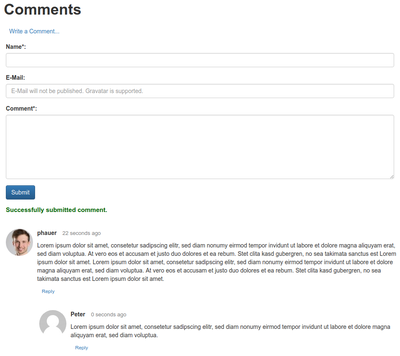

# comment-sidecar

comment-sidecar is a **lightweight, tracking-free, self-hosted comment service**. It aims at restricted self-hosted web spaces where only **PHP and MySQL** are available. And it is easy to embed into statically generated sites that are created with Hugo or Jekyll. It's a Disqus alternative.

[](https://raw.githubusercontent.com/phauer/comment-sidecar/master/screenshot-frontend.png)
 
# Features

- Tracking-free and fast. The comment-sidecar only needs one additional request. Contrary, Disqus leads to **110 additional requests**! Read [here](http://donw.io/post/github-comments/) for more details about Disqus' tracking greed and performance impact.
- Privacy. Your data belongs to you.
- Easy to integrate. Just a simple Javascript call. This makes it easy to use the comment-sidecar in conjunction with static site generators like **Hugo** or Jekyll. You don't have to integrate PHP code in the generated HTML files.
- Lightweight: No additional PHP or JavaScript dependencies. Just drop the files on your web server and you are good to go.
- No account required. The visitors of your site don't need to have an account to drop a comment.
- No performance impact on TTFB (Time To First Byte), because the comments are loaded asynchronously.
- Spam Protection.
- E-Mail Notification.
    - Admin receives mail for every comment.
    - Users receive Mail if there is an direct reply to their comment.
- Use one comment-sidecar installation for multiple sites.
- Replying to a comment is supported.
- Multi-language support (pull requests adding more languages are highly welcome).
- Customizable Form HTML
- Import existing Disqus comments.
- Simple rate limiting based on the IP address (`$_SERVER['REMOTE_ADDR']`)

# Requirements

- PHP. Tested with 7.1.
- A MySQL database. Tested with 5.7.28.
- Some native [ECMAScript 6](http://es6-features.org/) support in the user's browser. For now, the comment-sidecar requires support for basic ECMAScript 6 features like [arrow functions](http://www.caniuse.com/#search=arrow), [`const`](http://www.caniuse.com/#search=const), [template literals](http://www.caniuse.com/#search=template) and other modern methods like [`querySelector()`](http://www.caniuse.com/#search=queryselector) and [`fetch()`](http://www.caniuse.com/#search=fetch). Currently, the supporting browser versions have a global usage of 73% - 98%. This was good enough for me. So I decided against a compilation with Babel in order to avoid a dedicated build process. However, pull requests are always welcome. Alternatively, you can compile the `comment-sidecar.js` manually once only.

# Try it out up front!

Do you want to try the comment-sidecar before you install it on your site? No problem! You only need Docker and Docker-Compose and you are ready to go.
 
```bash
docker-compose up
```

This starts a MySQL database (which already contains the required table and index), [MailHog](https://github.com/mailhog/MailHog) (a test mail server) and an Apache with PHP.

Now open [`http://localhost/playground.html`](http://localhost/playground.html) in your browser and play with the comment-sidecar in action. On [`http://localhost:8025/`](http://localhost:8025/) you can see the sent notification mails.

# Installation

Create a MySQL database and note the credentials. 

Create the required table and the index. Therefore, execute the SQL statements in  [`sql/init.sql`](https://github.com/phauer/comment-sidecar/blob/master/sql/init.sql) 

Copy whole content of the `src` directory (except `playground.html`) to your web space. You can put it wherever you like. Just remember the path. The following example assumes that all files are put in the root directory `/`.

Open `config.php` and configure it:

```php
<?php
const LANGUAGE = "en"; # see translations folder for supported languages
const SITE = "domain.com"; # key for this site to identity comment of this site
const E_MAIL_FOR_NOTIFICATIONS = "your.email@domain.com";
const BASE_URL = "http://domainC.com/"; # base url of the comment-sidecar backend. can differ from the embedding site.
const ALLOWED_ACCESSING_SITES = [ "http://domainA.com", "http://domainB.com" ]; # sites that are allowed to access the backend (required for multisite setups, where the backend is deployed on a different domain than the embedding site.)

const DB_HOST = 'localhost'; # to access from host system, use 127.0.0.1
const DB_NAME = 'wb3d23s';
const DB_USER = 'wb3d23s';
const DB_PW = '1234';
const DB_PORT = 3306;

const FORM_TEMPLATE = "bootstrap-default"; # see for-templates folder to available form templates or define your own. examples: "bootstrap-default" or "bulma-default".
const BUTTON_CSS_CLASSES_ADD_COMMENT = "btn btn-link"; # css classes for the button. bootstrap: "btn btn-link". bulma: "button is-link"
const BUTTON_CSS_CLASSES_REPLY = "btn btn-link"; # css classes for the button. bootstrap: "btn btn-link". bulma: "button is-link is-small"

const RATE_LIMIT_THRESHOLD_SECONDS = "0"; # how long a user (defined by their IP) have to wait until they can comment again
```

Open the HTML file where you like to embed the comments. Insert the following snippet and set the correct path of `comment-sidecar.js`.

```html
<aside id="comment-sidecar"></aside>
<script type="text/javascript">
    (function() {
        const scriptNode = document.createElement('script');
        scriptNode.type = 'text/javascript';
        scriptNode.async = true;
        scriptNode.src = 'http://domainC.com/comment-sidecar-js-delivery.php'; //adjust to the correct path
        (document.getElementsByTagName('head')[0] || document.getElementsByTagName('body')[0]).appendChild(scriptNode);
    })();
</script>
```

Optionally, you can include `comment-sidecar-basic.css` in the HTML header to get some basic styling. Or you can simply copy its content to your own CSS file in order to avoid a additional HTTP request.

A complete example for the frontend can be found in [`src/playground.html`](https://github.com/phauer/comment-sidecar/blob/master/src/playground.html).

# Import Existing Disqus Comments into Comment-Sidecar

First, Export your Disqus Comments as an XML file. Details can be found [here](https://help.disqus.com/en/articles/1717164-comments-export).

Second, call

```bash
poetry shell
# print help and some descriptions
python import/import_disqus_comments.py --help 
# execute the command
python import/import_disqus_comments.py --disqus_xml_file phauer.xml --site_url https://phauer.com --cs_site_key phauer.com --db_host db_host --db_port 3306 --db_user db_user --db_password db_password --db_name db_name
``` 

# Development

## PHP Backend Service

```bash
# start apache with php, mysql database (with the required table) and mailhog in docker containers
docker-compose up -d

# now you can execute HTTP requests like
http http://localhost/comment-sidecar.php
http POST http://localhost/comment-sidecar.php < adhoc/comment-payload.json

# develop in src/comment-sidecar.php. The changes take effect immediately. 
```

## Run the Python Tests for the Backend

```bash
# start mysql database and mailhog in docker containers
docker-compose up -d

# set up python environment
python3 --version # you need at least python 3.5 to run the tests
# install poetry. e.g. `yay install python-poetry`
poetry install # install devs in a venv
poetry env info 
# configure your IDE with the displayed path
# now, you can execute the tests directly from the IDE

# execute all tests
poetry shell
pytest

# or only a single test:
poetry shell
pytest test/test_comment_sidecar.py
```

## Frontend

I'm using [Browsersync](https://www.browsersync.io/) to automatically reload my browser during development.

```bash
# install browsersync
npm install
# watch for changes and reload browser automatically
npm run watch
```

See [Browsersync command line usage](https://www.browsersync.io/docs/command-line) for more details.

## Test Multi-site Scenarios and Different Origins

You can use one deployed comment-sidecar backend for multiple sites. So we different domains and have to take [CORS](https://developer.mozilla.org/en-US/docs/Web/HTTP/Access_control_CORS) headers into account. To simulate this locally, use the proxy server of browsersync.

```bash
# the backend runs in the php container on port 80
# let's start browsersync's proxy on port 3000
npm run watch-with-proxy
# open localhost:3000/playground.html in your browser
# it will now try to communicate with the backend on port 80
```

Alternatively, you can use IntelliJ's built-in server. Just right-click on `playground.html` and select `Open in Browser`.

## See the Sent Mails

MailHog provides a neat Web UI. Just open [`http://localhost:8025/`](http://localhost:8025/) after calling `docker-compose up`.

## Connect to the MySQL Container using a MySQL Client

Use host `127.0.0.1` instead of `localhost`! Port `3306`. Database `comment-sidecar`. User `root` and password `root`.

## Debugging with IntelliJ IDEA/PhpStorm

A tutorial for set up remote debugging of PHP code executed in a Docker container can be found [here](https://blog.philipphauer.de/debug-php-docker-container-idea-phpstorm/). 
